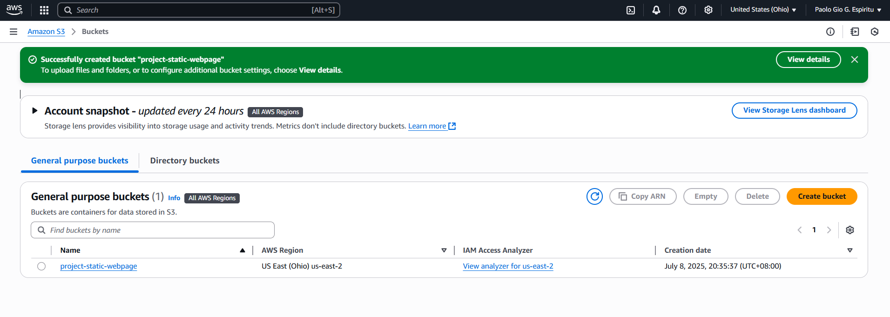
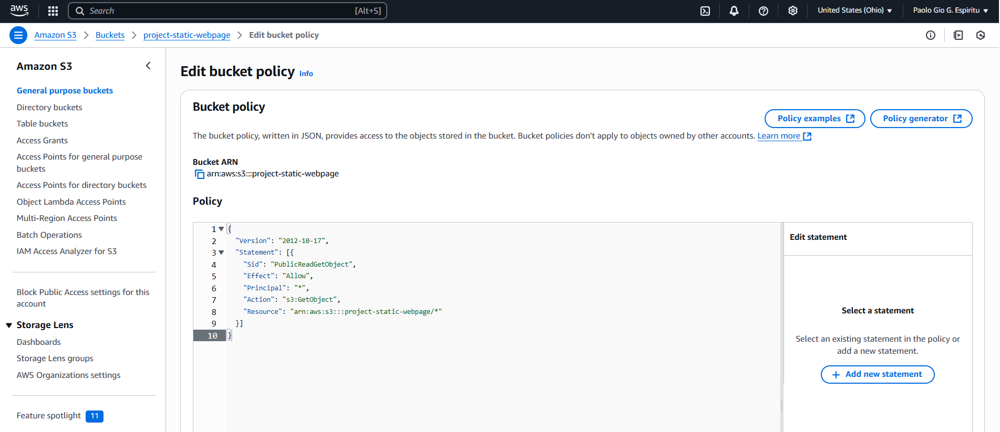
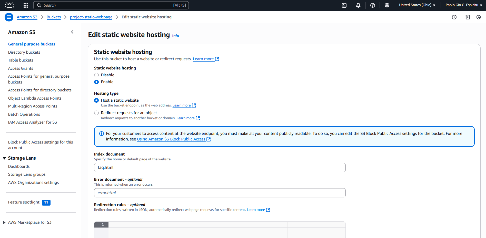
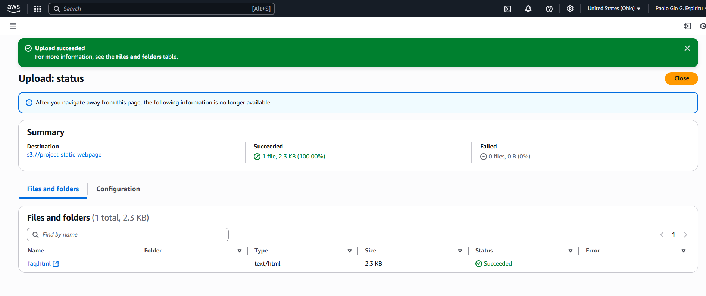
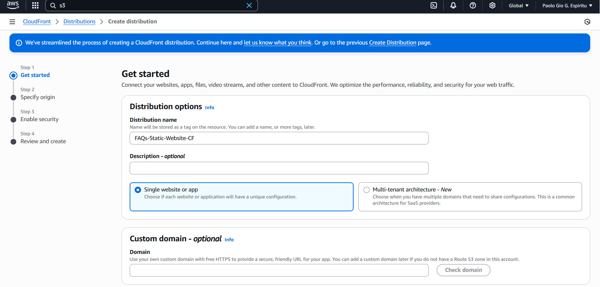
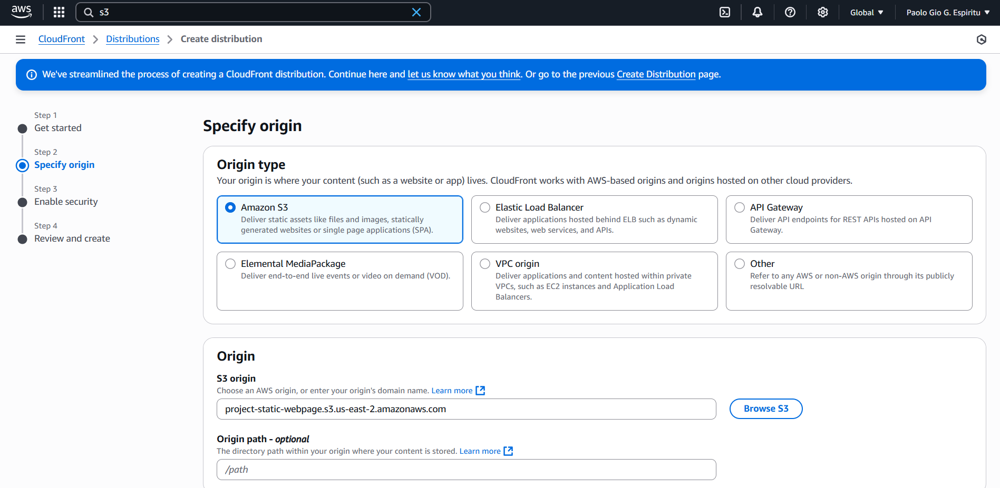
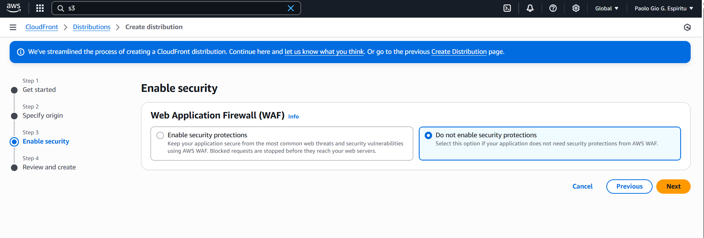
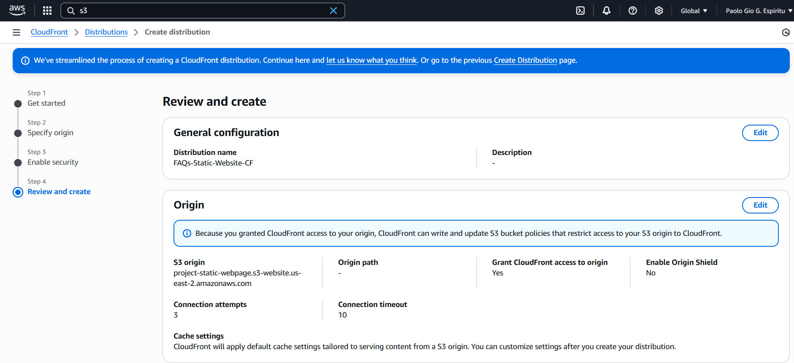
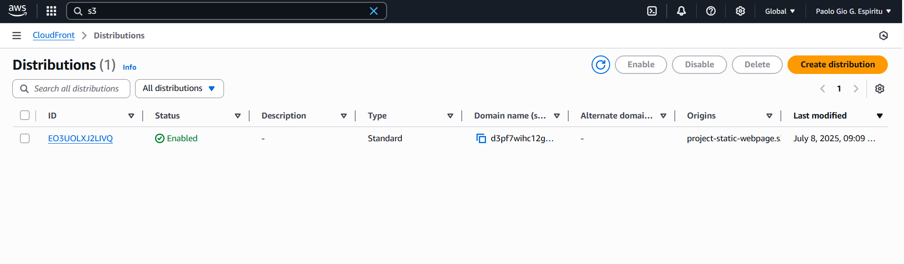
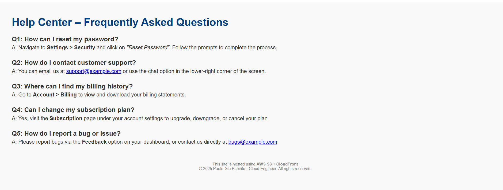

## 📸 Project Screenshots

Below are the screenshots documenting the full deployment process of hosting a static site (`faq.html`) using AWS S3 and CloudFront.  
All images are stored in the `images/` folder of this repository.

---

### 🪣 1. Creating an S3 Bucket
Setting up a new S3 bucket to host the static site.

---

### 🔐 2. Configuring Bucket Policy
Applying a custom bucket policy to allow public access to the website files.

---

### 🌐 3. Enabling Static Website Hosting
Turning on static website hosting and specifying the index document (`faq.html`).

---

### 📁 4. Uploading `faq.html` to S3
Uploading the main HTML file (`faq.html`) into the S3 bucket.

---

### 🚀 5. CloudFront Setup – Step 1
Starting the process of creating a CloudFront distribution for the S3 site.

---

### 🚀 6. CloudFront Setup – Step 2
Selecting the S3 website endpoint as the origin.

---

### 🚀 7. CloudFront Setup – Step 3
Configuring cache behavior and viewer protocol policy.

---

### 🚀 8. CloudFront Setup – Step 4
Finalizing the settings before creating the distribution.

---

### ✅ 9. CloudFront Distribution Successfully Created
CloudFront distribution is now active and linked to the S3 bucket.

---

### 🌍 10. Website Live via CloudFront
The `faq.html` page successfully loaded from CloudFront, confirming the site works globally.

